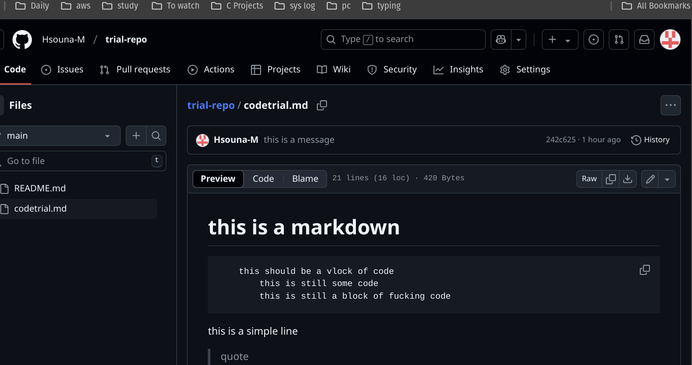

# this is a markdown
        this should be a vlock of code 
            this is still some code 
            this is still a block of fucking code 
this is a simple line
> quote 
>> under quote in a quote 

`line of code` waht about **bold** and *italic*
* list 
 * unordered list 
    * still a list 
    * bro 
        * this a codde 
        
1. what is this 
2. this is just a code example 
3. what is this 

now this is a image   i hope git hub gets it

    
